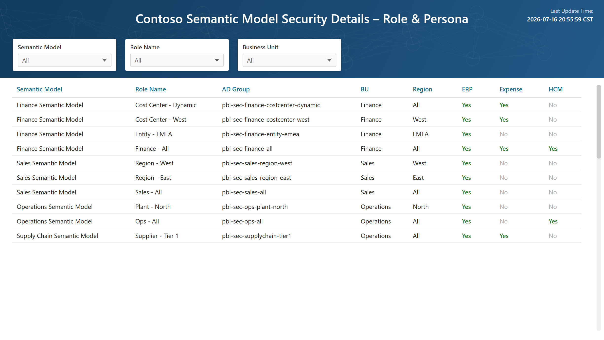
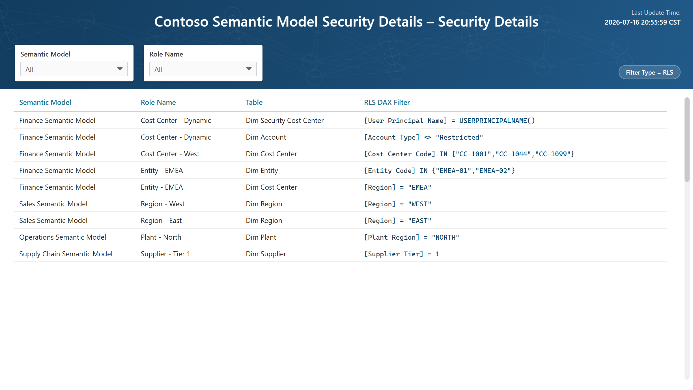
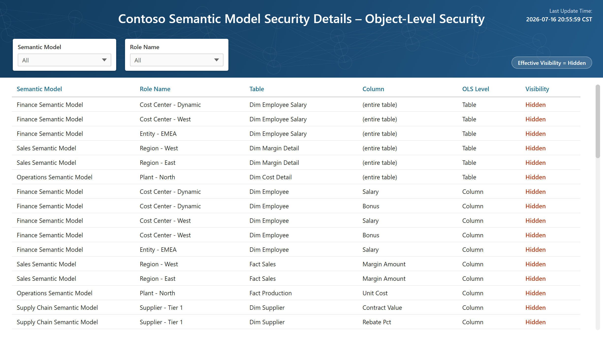
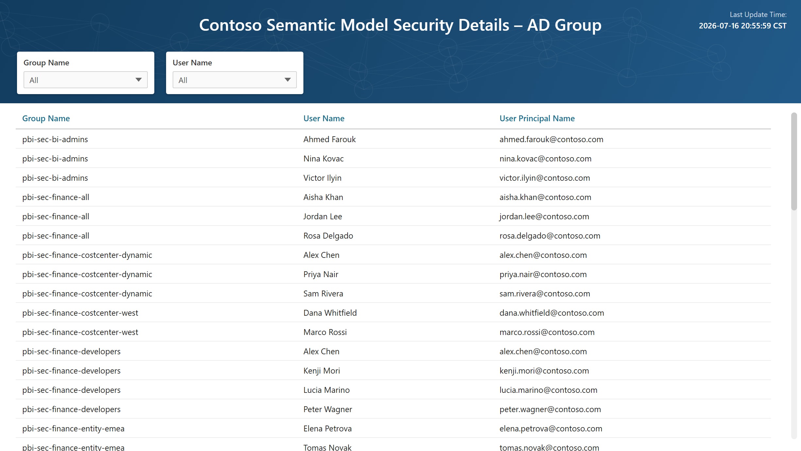
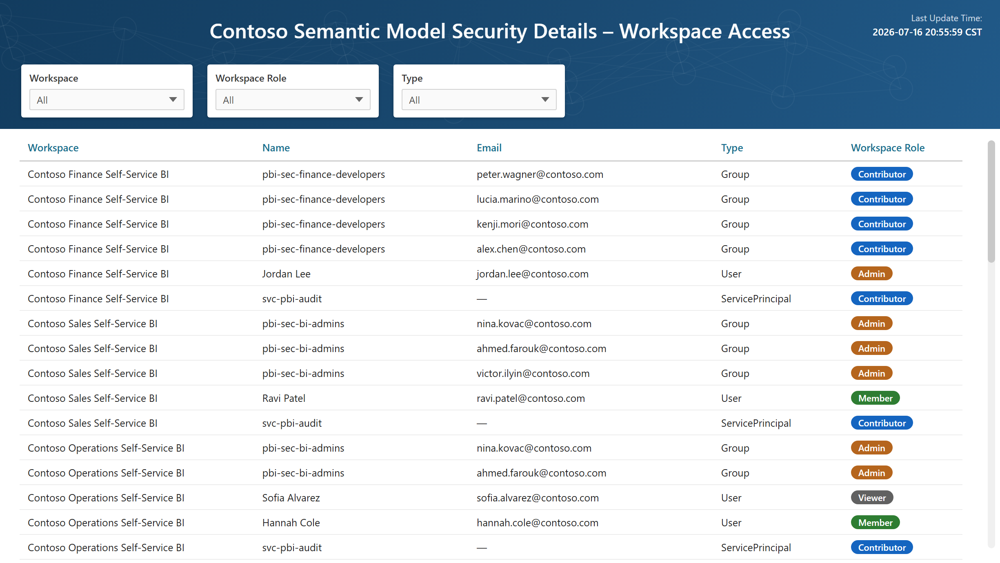
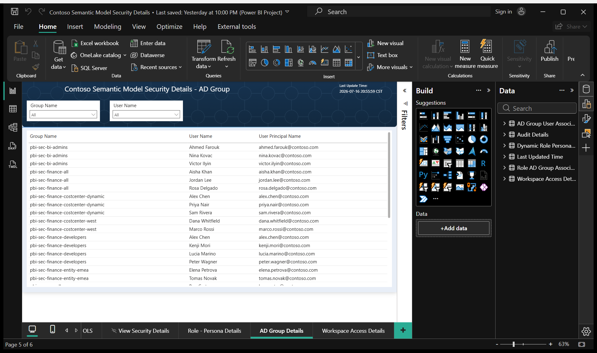

# Who Can See What? Auditing Power BI Semantic Model Security in Microsoft Fabric — Part 2: The Semantic Model and Audit Report

*Part 2 of 2. In [Part 1](Part%201%20-%20Building%20the%20Power%20BI%20Access%20Audit%20Pipeline%20in%20Fabric.md) we built the pipeline: Fabric notebooks that harvest RLS/OLS definitions, role memberships, AD group members, and workspace role assignments into a lakehouse. This post builds the consumption layer — the semantic model and the six-page audit report — and closes with extensions and lessons learned.*

`Microsoft Fabric` · `Power BI` · `Semantic model` · `RLS / OLS` · ~10 min read

---

## Quick recap

After Part 1, the `pbi_security_audit` lakehouse holds:

| Table | Contents |
|---|---|
| `pbi_model_security_audit_details` | RLS DAX filters + OLS visibility, per model × role × table (× column) |
| `pbi_model_security_role_association_details` | Which Entra group (object ID) sits in which role |
| `pbi_model_security_adgroup_user_details` | Which users are inside those groups |
| `pbi_workspace_access_audit_details` | Workspace role assignments, groups expanded to users |
| `pbi_role_personas` | Business-friendly description of what each role/persona filters |

The goal now: one report where a compliance reviewer can pick any semantic model and see **roles → filters → groups → people → workspace roles** without writing a line of SQL.

*(The five steps that populate those tables are compiled into one runnable Fabric notebook —
[`NB_Semantic_Model_Access_Audit.ipynb`](NB_Semantic_Model_Access_Audit.ipynb), with a built-in validation section — covered in Part 1.)*

---

## The semantic model

### Connectivity

The audit model is a small **import-mode** model reading from the lakehouse's **SQL analytics endpoint**. Every table follows the same Power Query pattern: connect, pick the table, rename the snake_case columns to friendly names:

```powerquery-m
let
    Source = Sql.Databases("xxxxxxxx.datawarehouse.fabric.microsoft.com"),
    pbi_security_audit = Source{[Name="pbi_security_audit"]}[Data],
    audit = pbi_security_audit{[Schema="dbo",Item="pbi_model_security_audit_details"]}[Data],
    Renamed = Table.RenameColumns(audit, {
        {"Workspace", "Workspace Name"}, {"Semantic_Model", "Semantic Model Name"},
        {"Role_Name", "Role Name"}, {"Table_Name", "Table Name"},
        {"Filter_Type", "Filter Type"}, {"Column_Name", "Column Name"},
        {"Column_Permission", "Column Permission"}, {"OLS_Level", "OLS Level"},
        {"Effective_Visibility", "Visibility"}
    }),
    // Composite key used to relate audit rows to role membership rows
    WithKey = Table.AddColumn(Renamed, "Key",
        each [Workspace Name] & " | " & [Semantic Model Name] & " | " & [Role Name])
in
    WithKey
```

(Import keeps the report snappy and decouples it from notebook run times; a Direct Lake model over the same tables works too if you prefer zero-copy.)

### Tables and relationships

Six tables — five from the lakehouse plus one tiny generated one:

| Model table | Source | Notes |
|---|---|---|
| **Audit Details** | `pbi_model_security_audit_details` | + computed `Key` column |
| **Role AD Group Association** | `pbi_model_security_role_association_details` | `Member_ID` renamed to **Group Object ID**; + same `Key` column |
| **AD Group User Association** | `pbi_model_security_adgroup_user_details` | group → user membership |
| **Workspace Access Details** | `pbi_workspace_access_audit_details` | standalone (no relationships needed) |
| **Dynamic Role Persona Details** | `pbi_role_personas` (filtered `Active = "1"`) | persona → filter-attribute matrix |
| **Last Updated Time** | generated in M | one-row refresh timestamp |

Three relationships stitch the story together:

```
Audit Details[Key] ─────────────── Role AD Group Association[Key]
        (Workspace | Model | Role composite key)

Role AD Group Association[Group Object ID] ─── AD Group User Association[Group Object ID]
        ★ the linchpin

Dynamic Role Persona Details[AD_Group] ─────── AD Group User Association[Group Name]
```


*Three many-to-many, single-direction relationships. The `Group Object ID` join (★) is the linchpin that connects a role to the people inside it.*

Two of these deserve explanation:

**The composite `Key`.** `Audit Details` and `Role AD Group Association` both have workspace × model × role grain (audit details go finer, down to table/column). Rather than a relationship over `Role Name` alone — which breaks the moment two models both define a role called "Viewer" — both Power Query scripts add `Key = Workspace | Model | Role`, giving one honest relationship instead of three ambiguous ones.

**The Group Object ID linchpin.** This is the payoff of Part 1's design: TOM reports each role member's `MemberID`, Graph reports each group's `id`, and they are **the same Entra object ID**. That single column connects "this role exists on this model" to "these are the humans inside it". No name matching, no fuzzy joins.

### The `Last Updated Time` table

An audit answer is only as good as its timestamp. A one-row M table captures the refresh time (converted to our reporting timezone) and every report page displays it:

```powerquery-m
let
    LocalTime  = DateTimeZone.SwitchZone(DateTimeZone.UtcNow(), -6),
    Formatted  = DateTime.ToText(DateTimeZone.RemoveZone(LocalTime),
                                 "yyyy-MM-dd HH:mm:ss") & " CST",
    Source     = #table({"Last Updated"}, {{Formatted}})
in
    Source
```

Cheap, refresh-driven, and it preempts the first question every auditor asks: *"as of when?"*

### The persona matrix

RLS filter DAX is precise but hostile to business readers. `pbi_role_personas` is a small mapping table (maintained alongside the model inventory workbook) that describes each persona in columns instead of code — which business unit, cost centers (include/exclude), accounts, entities, line of business, and which source-system slices (ERP, Expense, HCM, …) the persona is meant to see. The report shows it side-by-side with the raw DAX, so reviewers can spot "the filter says X but the persona sheet says Y" mismatches — which is exactly the kind of drift an access audit is supposed to catch.

---

## The report

Six pages. All of them follow the same layout language (title, last-updated stamp, slicer rail), so reviewers always know where they are.

> 📷 Every page below is shown on the **fabricated sample data** that ships with the downloadable template
> (see the end of this post) — so every workspace, model, role, group, filter, and person here is invented.

### 1. Role – Persona Details *(landing page)*

**Answers Q1 + Q2 + Q3: who has access, via which role and group.**
A table of *Role Name → AD Group → User Name → User Principal Name*, with slicers for workspace, role, group, and user. This is the page that answers "who can see the Finance model?" in one glance — and because the group→user expansion came from Graph, it shows *people*, not just group names.



### 2. Security Details (RLS)

**Answers Q5 (RLS half): what each role actually filters.**
Table of *Role Name → Table Name → Filter (the DAX expression)*, page-filtered to `Filter Type = "RLS"`. A bookmark-driven **RLS/OLS toggle** (two buttons wired to bookmarks) flips between this page and the OLS page, so the pair behaves like one page with two lenses.



### 3. OLS *(hidden; reached via the toggle)*

**Answers Q5 (OLS half): what each role can't even see.**
Table of *Role → Table → Column → Column Permission*, pre-filtered to `Filter Type = "OLS"` and `Column Permission = "None"` — the default view shows only what's *hidden*, which is what reviewers care about. An `OLS Level` slicer distinguishes table-level blackouts (the collapsed `*` rows from Part 1) from column-level ones.



### 4. View Security Details *(hidden drill-through)*

Right-click any role anywhere → drill through to a consolidated view: the role's RLS filters (as a matrix of *Role → Table → Filter*) next to its persona description (*Role → AD Group → CostCenter/Account/Entity*). One role, complete picture, one click.

### 5. AD Group Details

**Answers Q3 from the group side.** Group → User → UPN with group/user slicers. Handy when the question arrives group-first ("who's in `pbi-sec-finance-costcenter-viewers`?") rather than model-first.



### 6. Workspace Access Details

**Answers Q4: workspace roles.** Workspace → principal (AD Group / User / Service Principal) → email → workspace role, with slicers on each. This page regularly finds the classic governance gap: someone with a modest RLS role who is *also* workspace Admin — meaning their RLS doesn't apply at all.



### The question-to-page map

| Audit question | Page | Backing table(s) |
|---|---|---|
| Q1 Who has access to each model | Role – Persona Details | Role AD Group Association + AD Group User Association |
| Q2 Which role are they tagged to | Role – Persona Details | Role AD Group Association |
| Q3 Which AD group grants it | Role – Persona / AD Group Details | AD Group User Association |
| Q4 What workspace role they hold | Workspace Access Details | Workspace Access Details |
| Q5 What the role filters (RLS/OLS) | Security Details + OLS (+ drill-through) | Audit Details |

---

## Extensions

Three additions we've built or planned — each one notebook cell away from the same lakehouse pattern.

### A. App audiences (Power BI Admin API)

Reports distributed through a **Power BI app** add another access path: app audiences. The Admin API enumerates them:

```python
# Requires: tenant setting "Service principals can access read-only admin APIs"
# (or a Fabric Administrator identity) — a plain workspace SP gets 403 here.
apps = requests.get(
    "https://api.powerbi.com/v1.0/myorg/admin/apps?$top=5000",
    headers=headers,  # Power BI-scoped token from Part 1, Step 3
).json()["value"]

for app_info in [a for a in apps if a.get("workspaceId") == workspace_id]:
    users = requests.get(
        f"https://api.powerbi.com/v1.0/myorg/admin/apps/{app_info['id']}/users",
        headers=headers,
    ).json()["value"]
    # -> normalize and save to pbi_security_audit.dbo.pbi_app_audience_details
```

We learned the 403 lesson first-hand: workspace access is **not** enough for `admin/*` routes. The SP must be covered by the read-only admin API tenant setting (via a security group) — coordinate with your Fabric admin before scheduling this one.

### B. Direct dataset permissions

Workspace roles and app audiences still aren't everything — individual **Build/Read grants on the dataset itself** (the "manage permissions" path) are a third access route. Two REST calls close the gap:

```python
ws_users = requests.get(f"{PBI}/groups/{ws_id}/users", headers=headers).json()["value"]
ds_users = requests.get(f"{PBI}/groups/{ws_id}/datasets/{ds_id}/users",
                        headers=headers).json()["value"]

ws_ids = {u.get("identifier") for u in ws_users}
direct_grants = [u for u in ds_users if u.get("identifier") not in ws_ids]
```

Anyone in `ds_users` but not in `ws_users` has a **direct** grant on the model — exactly the kind of one-off access that audits exist to find.

### C. Workspace lineage (bonus)

For "which reports does this model feed?", `sempy.fabric` one-liners cover it:

```python
import sempy.fabric as fabric

ws_id      = fabric.resolve_workspace_id("Contoso Finance Self-Service BI")
df_models  = fabric.list_datasets(workspace=ws_id)
df_reports = fabric.list_reports(workspace=ws_id)   # includes Dataset Id per report
df_items   = fabric.list_items(workspace=ws_id)     # notebooks, lakehouses, pipelines...
```

Join reports to models on dataset ID and you have a report → semantic model lineage table — useful context when an RLS change is proposed and someone asks "what does this break?".

---

## Lessons learned

1. **Query scale-out silently breaks security extraction.** Read replicas don't reliably serve role/membership metadata. Detect `maxReadOnlyReplicas` via REST, drain, extract on the primary, restore. (Part 1, Step 3 — our biggest time sink.)
2. **INFO functions are great interactively, wrong for this pipeline.** Our first implementation used `INFO.ROLES()` / `INFO.ROLEMEMBERSHIPS()` DAX. It worked — until scale-out. TOM via `semantic-link-labs` proved authoritative and also exposes OLS, which the DAX route made awkward.
3. **Record errors as data.** "Service principal not in workspace" rows land in the audit table with `Filter_Type = "ERROR"`. Coverage gaps become visible findings on the report instead of silent holes.
4. **Object IDs beat names as join keys.** The TOM `MemberID` ↔ Graph group `id` equality is what makes the whole model click. Names get renamed; object IDs don't.
5. **Admin APIs are a different permission tier.** Workspace access gets you `groups/*` routes; `admin/*` routes need the tenant-level read-only admin API setting. Budget the conversation with your admin team.
6. **Translate DAX for your auditors.** The persona matrix (plain-language filter descriptions next to raw expressions) turned the report from "a developer tool" into "the thing compliance actually signs off on".

---

## Download the sample report

Rather than describe the report and leave you to rebuild it, here it is: **`contoso-access-audit-pbip.zip`**
— the complete six-page report and semantic model as a **PBIP project**.

It ships with **fabricated sample data** (3 workspaces, 4 semantic models, 10 roles, 12 AD groups, 30 users,
RLS filters and both flavours of OLS) loaded from CSV files, so it opens in Power BI Desktop with **no tenant,
no gateway, no service principal and no credentials**:

1. Unzip to `C:\ContosoAccessAudit`.
2. Open `Contoso Semantic Model Security Details.pbip`.
3. Click **Refresh**.

Unzipped somewhere else? Point the **`CsvFolder`** parameter at your `Data` folder
(*Home → Transform data → Edit parameters*) and refresh.



*The downloadable template open in Power BI Desktop, refreshed on the fabricated sample data — no tenant or credentials required.*

The CSV headers are deliberately the same snake_case names the notebooks in [Part 1](Part%201%20-%20Building%20the%20Power%20BI%20Access%20Audit%20Pipeline%20in%20Fabric.md) write
(`Workspace`, `Semantic_Model`, `Role_Name`, …), so the Power Query in the template is the *same* code the
real solution runs. Pointing it at your own lakehouse is a one-step change — every table's M begins with a
comment showing the swap:

```powerquery-m
// Sample (the template):
Source = Csv.Document(File.Contents(CsvFolder & "\pbi_model_security_audit_details.csv"),
                      [Delimiter=",", Encoding=65001, QuoteStyle=QuoteStyle.Csv]),
dbo_pbi_model_security_audit_details = Table.PromoteHeaders(Source, [PromoteAllScalars=true]),

// Production (your Fabric lakehouse):
Source   = Sql.Databases("<your-endpoint>.datawarehouse.fabric.microsoft.com"),
Database = Source{[Name="pbi_security_audit"]}[Data],
dbo_pbi_model_security_audit_details = Database{[Schema="dbo",Item="pbi_model_security_audit_details"]}[Data],
```

Everything downstream — the renames, the `Key` column, the relationships, all six pages — stays exactly as-is.

> One deliberate detail in the sample: a `Filter_Type = ERROR` row for *Legacy Inventory Semantic Model*,
> so you can see how the pipeline records "the service principal couldn't read this model" as data instead
> of failing the run.

---

## Wrapping up

What started as an awkward compliance question — *"who can see what?"* — became a small data product: two notebooks, five Delta tables, one semantic model, six report pages. The audit that used to take days of screenshotting role dialogs is now a scheduled refresh, and every answer carries its own timestamp.

If you build something similar (or find a better way around the scale-out drain), I'd love to hear about it in the comments.

---

## Questions & suggestions

Questions, corrections, or a cleaner way around the scale-out drain? I'd genuinely like to hear it — leave a comment below, or reach out to the authors directly. Issues and pull requests on the [companion repo](https://github.com/NatarajanManivasagan/Fabric-Audit-Log) are welcome too.

## About the authors

| Role | Name | Connect |
|---|---|---|
| **Author** | Natarajan Manivasagan | [LinkedIn](https://www.linkedin.com/in/natarajan-manivasagan/) · [Fabric Community](https://community.fabric.microsoft.com/users/natarajan_m/1345926) |
| **Co-author** | Praful Potphode | [LinkedIn](https://www.linkedin.com/in/praful-p-912349241/) · [Fabric Community](https://community.fabric.microsoft.com/users/praful_potphode/1261729) |
| **Co-author** | Hardik Sri | [LinkedIn](https://www.linkedin.com/in/hardiksri98/) · [Fabric Community](https://community.fabric.microsoft.com/users/hardiksri/1586944) |

## Further reading

- [semantic-link-labs — documentation & source](https://github.com/microsoft/semantic-link-labs)
- [Row-level security (RLS) in Power BI / Fabric](https://learn.microsoft.com/fabric/security/service-admin-row-level-security)
- [Object-level security (OLS)](https://learn.microsoft.com/fabric/security/service-admin-object-level-security)
- [Roles in workspaces — why a workspace Admin bypasses RLS](https://learn.microsoft.com/fabric/fundamentals/roles-workspaces)

---

> **This series** · [← Part 1: Building the Audit Pipeline](Part%201%20-%20Building%20the%20Power%20BI%20Access%20Audit%20Pipeline%20in%20Fabric.md) · **Part 2: The Semantic Model and Audit Report** *(you are here)*

*The views in this post are my own and don't necessarily represent my employer. All workspace names, model names, group names, and IDs are fictionalized — the patterns are real.*
