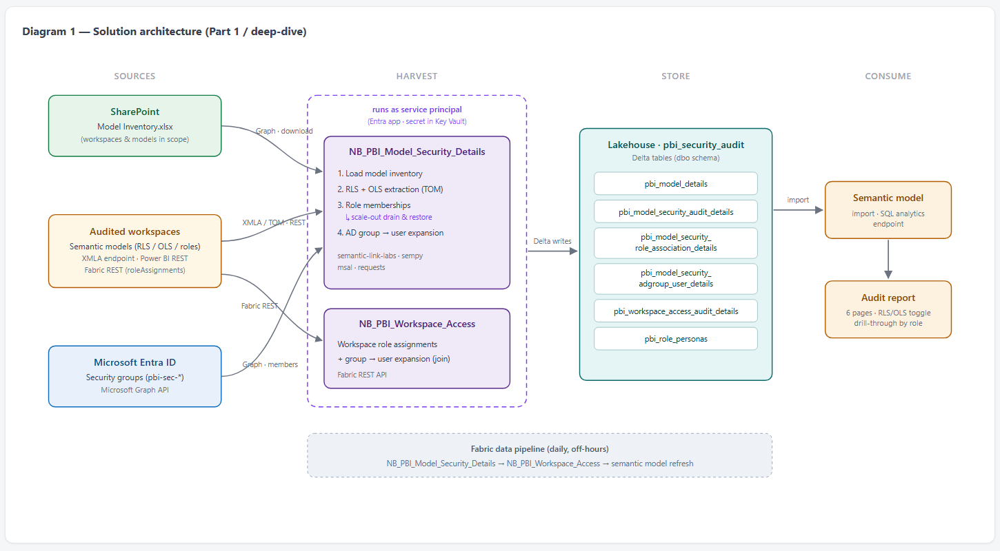
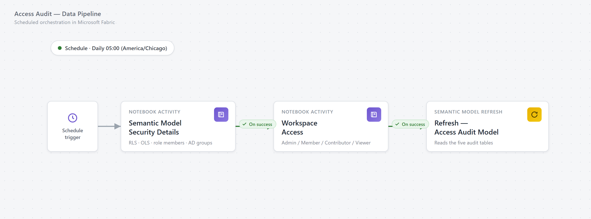

# Who Can See What? A Complete Power BI Access Audit Solution in Microsoft Fabric

*A deep dive: Fabric notebooks harvest RLS/OLS definitions, role memberships, AD group members, and workspace roles into a lakehouse — and a Power BI report on top answers every "who can see what?" question on demand.*

`Microsoft Fabric` · `Power BI` · `RLS / OLS` · `Security & Governance` · ~18 min read

> 📦 **Grab the sample project.** The finished report and semantic model are downloadable as a **PBIP template**
> (`contoso-access-audit-pbip.zip`) wired to fabricated CSV data — it opens in Power BI Desktop with no tenant,
> no service principal and no credentials. Unzip to `C:\ContosoAccessAudit`, open the `.pbip`, hit Refresh, and
> click around while you read. ([Details below.](#download-the-sample-report))
>
> 📓 The whole pipeline is also compiled into one runnable notebook —
> **[`NB_Semantic_Model_Access_Audit.ipynb`](NB_Semantic_Model_Access_Audit.ipynb)** with a built-in validation section
> ([get it below](#get-the-notebook--and-check-its-correct)).

**Contents:** [The problem](#the-problem) · [Architecture](#solution-architecture) · [Prerequisites](#prerequisites) · [Step 1 — Inventory](#step-1--load-the-model-inventory-from-sharepoint) · [Step 2 — RLS/OLS](#step-2--extract-rls-and-ols-with-semantic-link-labs-tom) · [Step 3 — Memberships](#step-3--role-memberships-and-the-query-scale-out-trap) · [Step 4 — Graph](#step-4--expand-ad-groups-into-users-via-microsoft-graph) · [Step 5 — Workspace roles](#step-5--workspace-role-assignments-via-the-fabric-rest-api) · [Notebook & testing](#get-the-notebook--and-check-its-correct) · [Semantic model](#the-semantic-model) · [The report](#the-report) · [Extensions](#extensions) · [Download](#download-the-sample-report) · [Lessons learned](#lessons-learned)

---

## The problem

If you run a self-service BI platform, sooner or later someone from security, audit, or compliance asks a deceptively simple question:

> "Can you show me exactly who can see what in Power BI?"

That one question fans out into five:

1. **Which users have access to each semantic model?**
2. **Which security role is each user tagged to?**
3. **Which AD (Entra ID) group gives them that access?**
4. **What workspace role do they hold?**
5. **What DAX filters (RLS) — and table/column restrictions (OLS) — does each role actually apply?**

For one model you can answer this manually: open *Manage roles* in Desktop, cross-check group membership in the Entra portal, check workspace access in the Service. Across a fleet of self-service models in multiple workspaces, secured with a mix of **row-level security**, **object-level security**, and **Entra ID groups**, the manual answer is stale before you finish collecting it.

So we built the audit *as a data product*: Fabric notebooks harvest security metadata from every model, land it in a lakehouse, and a Power BI report answers all five questions on demand — with a refresh timestamp to prove how fresh the answer is. This post walks through the whole build, with all names and IDs genericized (Contoso-ified) so you can map it to your own tenant.

---

## Solution architecture



*The audit as a one-way data product: inventory workbook + service principal → notebooks → lakehouse → semantic model → report.*

| # | Component | Role |
|---|---|---|
| 1 | **SharePoint: `Model Inventory.xlsx`** | Scope control — a workbook listing the workspaces/models to audit. Adding a model = adding a row. |
| 2 | **Entra ID app registration (service principal)** | The identity that does all the reading: XMLA/TOM, REST APIs, Graph. |
| 3 | **Fabric notebooks** | The harvesters: `semantic-link` (SemPy), `semantic-link-labs`, Power BI & Fabric REST, Microsoft Graph. |
| 4 | **Lakehouse `pbi_security_audit`** | The audit store — one Delta table per question domain. |
| 5 | **Semantic model + 6-page report** | The consumption layer. |

```
SharePoint inventory ──►  Notebook 1: model inventory        ──►  pbi_model_details
                          Notebook 1: RLS/OLS via TOM         ──►  pbi_model_security_audit_details
                          Notebook 1: role memberships        ──►  pbi_model_security_role_association_details
                          Notebook 1: AD group expansion      ──►  pbi_model_security_adgroup_user_details
                          Notebook 2: workspace role scan     ──►  pbi_workspace_access_audit_details
                                                                        │
                                                                        ▼
                                                          Semantic model + audit report
```

> 🧭 **How the code is organized.** The steps below show the *essence* of each stage — the one call that matters and
> the shape of the row it produces — so the walkthrough stays readable. The complete, runnable code lives in a single
> notebook in the companion repo: **[`NB_Semantic_Model_Access_Audit.ipynb`](NB_Semantic_Model_Access_Audit.ipynb)**.
> That notebook is the **self-contained** variant — an inline `MODELS` list instead of the SharePoint inventory, and
> **DataFrame-first** (it writes nothing until you opt in). The snippets here show the fuller **production** shape
> (SharePoint inventory → Delta tables); the [notebook & testing](#get-the-notebook--and-check-its-correct) section
> explains the difference and how to prove a run is correct.

---

## Prerequisites

This is the part that takes longer than the code.

**1. App registration.** Create it in Entra ID; note Tenant ID / Client ID, create a client secret. Application permissions (admin-consented): Microsoft Graph `Group.Read.All` (group expansion) and `Sites.Read.All` (inventory download).

> ⚠️ **Secret hygiene.** The snippets read credentials from a `config.json` in lakehouse *Files* to keep the walkthrough simple. In production, use **Azure Key Vault** with `notebookutils.credentials.getSecret(...)`. This is a *security audit* solution — don't let it become the finding.

**2. Tenant settings** (Fabric admin portal): *Service principals can use Fabric APIs* enabled for a group containing the SP; **XMLA endpoint** at least *Read* on the capacity; and — only for the app-audience extension near the end — *Service principals can access read-only admin APIs*.

**3. Workspace access.** Add the SP to every audited workspace (Contributor is comfortable; the error handling below flags missing ones instead of failing the run).

**4. Lakehouse.** Create `pbi_security_audit` **with schema support** and attach it as the notebooks' default lakehouse.

**5. Library.** `%pip install semantic-link-labs` (or add it to your Fabric environment).

### The lakehouse tables

| Table | Grain | Answers |
|---|---|---|
| `pbi_model_details` | workspace × model | audit scope |
| `pbi_model_security_audit_details` | model × role × table (× column) | Q5 — RLS + OLS |
| `pbi_model_security_role_association_details` | model × role × member | Q2/Q3 — role → AD group |
| `pbi_model_security_adgroup_user_details` | group × user | Q1/Q3 — group → people |
| `pbi_workspace_access_audit_details` | workspace × principal | Q4 — workspace roles |
| `pbi_role_personas` | persona | business description of each role's filters |

> 📋 See **[`SCHEMA.md`](SCHEMA.md)** for every column, type, and grain across all six tables.

---

## Step 1 — Load the model inventory from SharePoint

Scope lives in one SharePoint workbook — adding a model to the audit is adding a row. Authenticate as the service
principal, pull the workbook through Microsoft Graph, and land it as the scope table:

```python
# MSAL client-credentials token (Graph scope), then download the inventory workbook
headers = graph_headers(config)                 # Authorization: Bearer …
site = graph_get(".../sites/contoso.sharepoint.com:/sites/BIGovernance")
xlsx = graph_get(f".../sites/{site['id']}/drive/root:/PBI Governance/Model Inventory.xlsx:/content")

df = pd.read_excel(xlsx, sheet_name="Self Service Models", dtype=str)
#  ->  Workspace_Name | Semantic_Model_Name      (one row per model to audit)
```

> 📓 **Full runnable code:** [Step 1 in the notebook →](NB_Semantic_Model_Access_Audit.ipynb) *(the self-contained
> version skips SharePoint — you list the `(workspace, model)` pairs inline in a `MODELS` variable).*

---

## Step 2 — Extract RLS and OLS with semantic-link-labs (TOM)

The heart of the solution. For every model in the inventory we open a **read-only TOM connection** under the service principal and walk `Roles`:

- **RLS:** every `TablePermission.FilterExpression` = the role's DAX filter on that table.
- **OLS:** `MetadataPermission` on tables/columns. Table-level `None` → one collapsed row (`Column_Name = "*"`); otherwise one row per column with effective visibility (`Hidden`/`Visible`).

```python
set_service_principal(config["TENANT_ID"], config["CLIENT_ID"], config["CLIENT_SECRET"])

with connect_semantic_model(dataset, workspace, readonly=True) as tom:
    for role in tom.model.Roles:
        # RLS — the DAX filter this role applies to a table
        for perm in role.TablePermissions:
            if perm.FilterExpression:
                emit(role.Name, perm.Table.Name, filter=perm.FilterExpression, kind="RLS")

        # OLS — walk every table/column, default to Read, record what's hidden
        for table in tom.model.Tables:
            for column in table.Columns:
                emit(role.Name, table.Name, column.Name,
                     visibility=effective_visibility(role, table, column), kind="OLS")
```

A model the service principal *can't* read is caught and written as a `Filter_Type = "ERROR"` row rather than failing
the run — "we can't see this model" is itself an audit finding.

> 📓 **Full runnable code:** [Step 2 in the notebook →](NB_Semantic_Model_Access_Audit.ipynb) — the real
> `emit`/`effective_visibility` logic (table-level blackouts collapse to a `Column_Name = "*"` row; `RowNumber`
> columns are skipped) plus the eleven-column output schema.

Sample output (fabricated):

| Workspace | Semantic_Model | Role_Name | Table_Name | Column_Name | Filter | Filter_Type | Effective_Visibility |
|---|---|---|---|---|---|---|---|
| Contoso Finance Self-Service BI | Finance Semantic Model | Cost Center - Dynamic | Dim Cost Center | | `[Cost Center Code] IN {"CC-1001","CC-1044"}` | RLS | |
| Contoso Finance Self-Service BI | Finance Semantic Model | Finance - All | Dim Employee | Salary | | OLS | Hidden |
| Contoso Sales Self-Service BI | Sales Semantic Model | Region - West | Dim Region | | `[Region] = "WEST"` | RLS | |

Two design choices worth calling out:

- **Error rows instead of failures.** If the SP isn't in a workspace, we record `Filter_Type = "ERROR"` with the message — "we can't see this model" is itself an audit finding, not a silent gap.
- **Effective visibility, not raw permissions.** OLS metadata only lists exceptions; by walking every table/column and defaulting to `Read`, the output answers "what does this role see?" without the consumer knowing OLS semantics.

---

## Step 3 — Role memberships (and the query scale-out trap)

Role definitions are half the story; we also need **who is tagged to each role**. TOM exposes `role.Members`, and each member's `MemberID` is the **Entra object ID** of the group or user — the join key for the next step.

**The trap:** our first version used DAX `INFO` functions instead of TOM:

```dax
EVALUATE
VAR _Roles =
    SELECTCOLUMNS(INFO.ROLES(),
        "RoleID", [ID], "Role_Name", [Name], "Model_Permission", [ModelPermission])
VAR _Members =
    SELECTCOLUMNS(INFO.ROLEMEMBERSHIPS(),
        "RoleID", [RoleID], "Member_Name", [MemberName], "Member_ID", [MemberID])
RETURN
    NATURALLEFTOUTERJOIN(_Roles, _Members)
```

Great interactively — until it hit a model with **query scale-out** enabled. Scale-out routes reads to read-only replicas, where security metadata isn't reliably served; runs failed or returned incomplete membership for exactly those models.

**The workaround:** check `queryScaleOutSettings` via the Power BI REST API; if scale-out is on, temporarily set `maxReadOnlyReplicas = 0`, wait for replicas to drain, extract via TOM on the primary, then **restore the original setting**:

```python
for workspace, dataset in models:
    settings = get_scaleout_settings(ws_id, ds_id)          # Power BI REST
    if settings.get("maxReadOnlyReplicas", 0):              # scale-out on?
        update_scaleout(ws_id, ds_id, {"maxReadOnlyReplicas": 0})
        time.sleep(300)                                     # let read replicas drain

    with connect_semantic_model(workspace, dataset, readonly=True) as tom:
        for role in tom.model.Roles:
            for member in role.Members:
                emit(role.Name, member.MemberID)            # Entra object ID = join key

    update_scaleout(ws_id, ds_id, settings)                 # ALWAYS restore
```

> 💡 Budget for the drain wait per scale-out model, and make sure the *restore* runs even on failure (`try/finally` if you extend this). The PATCH needs write access on the dataset — workspace Contributor or above.

> 📓 **Full runnable code:** [Step 3 in the notebook →](NB_Semantic_Model_Access_Audit.ipynb) — including the
> `get_workspace_id` / `get_dataset_id` / `get_scaleout_settings` / `update_scaleout` REST helpers and the per-model
> error handling.

---

## Step 4 — Expand AD groups into users via Microsoft Graph

Roles map to **Entra ID groups**, not individuals. We follow a naming convention (`pbi-sec-*`) for all BI security groups, so one filtered Graph query finds them all, and a second pass pulls members:

```python
# One filtered query finds every BI security group; a second pass pulls its members
groups = graph_get_all(".../groups?$filter=startswith(displayName,'pbi-sec')&$select=id,displayName")
for g in groups:
    for m in graph_get_all(f".../groups/{g['id']}/members?$select=id,displayName,userPrincipalName"):
        if m["@odata.type"] == "#microsoft.graph.user":
            emit(g["displayName"], g["id"], m["displayName"], m["id"], m["userPrincipalName"])
#  ->  Group_Name | Group_Object_ID | User_Name | User_Object_ID | User_Principal_Name
```

> 📓 **Full runnable code:** [Step 4 in the notebook →](NB_Semantic_Model_Access_Audit.ipynb) — `graph_get_all`
> is the paged Graph helper (`@odata.nextLink` follow); `/members` returns *direct* members, so swap in
> `/transitiveMembers` for nested groups.

Note what happened across Steps 3 and 4: the role member's `MemberID` (TOM) and the group's `id` (Graph) are **the same Entra object ID** — the join that lets the report connect *role → group → human being*.

> 💡 No naming convention for BI security groups yet? This project is a good excuse to introduce one — the alternative is enumerating the whole tenant.

---

## Step 5 — Workspace role assignments via the Fabric REST API

Model-level security means nothing if someone is workspace Admin. `GET /v1/workspaces/{id}/roleAssignments` returns every principal with a role; where the principal is a group we expand it to people using the Step 4 table:

```python
for ws in workspaces:
    for a in fabric_get(f"/v1/workspaces/{ws['id']}/roleAssignments"):
        p = a["principal"]
        emit(ws["name"], p["displayName"],
             p.get("userDetails", {}).get("userPrincipalName"), p["type"], a["role"])

# Any principal of type Group is expanded to its members via the Step 4 table,
# so the report always resolves to actual people — with Email included.
```

> 📓 **Full runnable code:** [Step 5 in the notebook →](NB_Semantic_Model_Access_Audit.ipynb) — the workspace
> name→id lookup, the `pd.json_normalize` flattening of the `principal.*` fields, and the group-expansion merge.

| Workspace | Name | Email | Type | Role |
|---|---|---|---|---|
| Contoso Finance Self-Service BI | pbi-sec-finance-developers | alex.chen@contoso.com | Group | Contributor |
| Contoso Finance Self-Service BI | Jordan Lee | jordan.lee@contoso.com | User | Admin |
| Contoso Sales Self-Service BI | svc-pbi-audit | | ServicePrincipal | Contributor |

**Scheduling:** both notebooks are idempotent (`overwrite`), so a Fabric data pipeline runs them sequentially off-hours, followed by a semantic model refresh. The scale-out workaround can add ~5 minutes per affected model — plan accordingly.



*The scheduled pipeline: two notebook activities chained on success, then a semantic model refresh so the report always carries a fresh timestamp.*

---

## Get the notebook — and check it's correct

All five steps above are compiled into one **self-contained** Fabric notebook:
**[`NB_Semantic_Model_Access_Audit.ipynb`](NB_Semantic_Model_Access_Audit.ipynb)** — no SharePoint, no config
file, no external module. Import it (*Workspace → Import → Notebook*), then fill in a single **CONFIG** cell: your
service-principal `TENANT_ID` / `CLIENT_ID` / `CLIENT_SECRET`, and a `MODELS` list of the `(workspace, semantic model)`
pairs to audit. Run the install cell, **restart the kernel** (service-principal auth needs `semantic-link` ≥ 0.12.0),
then run top to bottom. It's **DataFrame-first** — each step builds a Spark DataFrame you can eyeball, and nothing is
written to the lakehouse until you flip `persist` on.

**How do you know the output is right?** The notebook ends with a **validation section** that:

- confirms all five result sets built and are non-empty;
- runs a **referential-integrity** check — every role member (group) should resolve to an AD group via `Member_ID = Group_Object_ID` (a non-zero count is expected only for individual-user members, or groups outside the `pbi-sec-*` convention);
- surfaces the `Filter_Type = "ERROR"` rows, so a model the service principal *couldn't* read is a visible finding, not a silent gap;
- answers all five audit questions in SQL for one model — if those return sensible rows, the pipeline is correct end to end.

Testing on a single model first is as easy as putting one pair in `MODELS`.

### Two ways to land the data — tables or CSV

The pipeline builds five DataFrames; how you *land* them decides how the semantic model reads them. The notebook's
`publish()` helper carries both options, commented out (it writes nothing by default):

**Production — Delta tables.** Keep scope in an **Excel inventory** workbook and credentials in **`config.json`** (the
fuller pattern shown in Steps 1–5), then persist each result as a managed Delta table:

```python
df.write.format("delta").mode("overwrite").option("overwriteSchema", "true").saveAsTable(f"{LH}.{name}")
```

Point an **import or Direct Lake** semantic model at those tables and build the report.

**Portable — CSV.** Or stay DataFrame-first and export each result to a CSV:

```python
df.toPandas().to_csv(f"/lakehouse/default/Files/audit_csv/{name}.csv", index=False)
```

Point a model at those CSVs instead — exactly what the [downloadable sample report](#download-the-sample-report) does: its Power Query reads the same snake_case CSVs, and switching that model to a live lakehouse is a one-line change.

### What a correct run looks like

I ran those checks against the fabricated sample dataset that ships with the template — the same schemas the notebook writes. Real output:

```
pbi_model_details                                     5 rows   ok
pbi_model_security_audit_details                     65 rows   ok
pbi_model_security_role_association_details          10 rows   ok
pbi_model_security_adgroup_user_details              31 rows   ok
pbi_workspace_access_audit_details                   16 rows   ok
```

**Zero orphans** on the referential-integrity check — every `Member_ID` resolved to a `Group_Object_ID`, the strongest single signal that Steps 3 and 4 agree with each other. The `Filter_Type = "ERROR"` row for *Legacy Inventory Semantic Model* appeared as data, exactly as intended.

Asking "who can see `Finance Semantic Model`?" returned 10 rows — four roles, resolved through their groups to actual people. The RLS check returned the five filters that model applies, including the dynamic one:

```
Role_Name             | Table_Name               | Filter
Cost Center - Dynamic | Dim Security Cost Center | [User Principal Name] = USERPRINCIPALNAME()
Cost Center - West    | Dim Cost Center          | [Cost Center Code] IN {"CC-1001","CC-1044","CC-1099"}
Entity - EMEA         | Dim Entity               | [Entity Code] IN {"EMEA-01","EMEA-02"}
...
```

And then the check that earns its keep — joining role membership to workspace roles:

```
User_Name  | Role_Name     | Workspace                       | Workspace_Role
Jordan Lee | Finance - All | Contoso Finance Self-Service BI | Admin
```

Jordan Lee sits in an RLS role *and* holds workspace **Admin** — which means that carefully-scoped role is doing nothing for them, because workspace Admins bypass RLS entirely. That single row is the whole reason this audit exists.

> 💡 Writing this section caught a bug in my own query: selecting only `Workspace, Name, Type, Role` from the workspace table renders a group expanded to four members as four identical-looking rows. Include `Email`. The notebook has the fixed version.

---

## The semantic model

The audit model is a small **import-mode** model over the lakehouse's **SQL analytics endpoint**. Every table uses the same Power Query pattern — connect, pick table, rename to friendly names:

```powerquery-m
let
    Source = Sql.Databases("xxxxxxxx.datawarehouse.fabric.microsoft.com"),
    pbi_security_audit = Source{[Name="pbi_security_audit"]}[Data],
    audit = pbi_security_audit{[Schema="dbo",Item="pbi_model_security_audit_details"]}[Data],
    Renamed = Table.RenameColumns(audit, {
        {"Workspace", "Workspace Name"}, {"Semantic_Model", "Semantic Model Name"},
        {"Role_Name", "Role Name"}, {"Table_Name", "Table Name"},
        {"Filter_Type", "Filter Type"}, {"Column_Name", "Column Name"},
        {"Column_Permission", "Column Permission"}, {"OLS_Level", "OLS Level"},
        {"Effective_Visibility", "Visibility"}
    }),
    // Composite key used to relate audit rows to role membership rows
    WithKey = Table.AddColumn(Renamed, "Key",
        each [Workspace Name] & " | " & [Semantic Model Name] & " | " & [Role Name])
in
    WithKey
```

Six tables — **Audit Details**, **Role AD Group Association**, **AD Group User Association**, **Workspace Access Details**, **Dynamic Role Persona Details** (a persona → filter-attribute matrix filtered to `Active = "1"`), and a generated **Last Updated Time** — joined by three relationships:

```
Audit Details[Key] ─────────────── Role AD Group Association[Key]
        (Workspace | Model | Role composite key)

Role AD Group Association[Group Object ID] ─── AD Group User Association[Group Object ID]
        ★ the linchpin

Dynamic Role Persona Details[AD_Group] ─────── AD Group User Association[Group Name]
```


*Three many-to-many, single-direction relationships. The `Group Object ID` join (★) is the linchpin that connects a role to the people inside it.*

Design notes:

- **The composite `Key`.** Both role-grain tables get `Key = Workspace | Model | Role` in Power Query. A relationship on `Role Name` alone breaks the moment two models both define a role called "Viewer"; the composite key gives one honest relationship.
- **The Group Object ID linchpin.** TOM's `MemberID` = Graph's group `id` = the same Entra object ID. No name matching, no fuzzy joins.
- **`Last Updated Time`.** A one-row M table stamping the refresh time — every page displays it, preempting the auditor's first question (*"as of when?"*):

```powerquery-m
let
    LocalTime  = DateTimeZone.SwitchZone(DateTimeZone.UtcNow(), -6),
    Formatted  = DateTime.ToText(DateTimeZone.RemoveZone(LocalTime),
                                 "yyyy-MM-dd HH:mm:ss") & " CST",
    Source     = #table({"Last Updated"}, {{Formatted}})
in
    Source
```

- **The persona matrix.** Raw RLS DAX is hostile to business readers. `pbi_role_personas` describes each persona in plain columns (business unit, cost centers include/exclude, accounts, entities, source-system slices). Shown next to the raw DAX, it lets reviewers catch "the filter says X but the persona sheet says Y" drift — exactly what an access audit exists to find.

---

## The report

Six pages, one layout language (title, last-updated stamp, slicer rail).

> 📷 Every page below is shown on the **fabricated sample data** that ships with the downloadable template
> ([details below](#download-the-sample-report)) — so every workspace, model, role, group, filter, and person here is invented.

1. **Role – Persona Details** *(landing)* — Role → AD Group → User → UPN with workspace/role/group/user slicers. Answers **Q1/Q2/Q3** in one glance, showing *people*, not just group names.
2. **Security Details (RLS)** — Role → Table → Filter (the DAX), page-filtered to `Filter Type = "RLS"`. A bookmark-driven **RLS/OLS toggle** (two buttons) flips between this page and the next.
3. **OLS** *(hidden; via toggle)* — Role → Table → Column → Permission, pre-filtered to `Column Permission = "None"` so the default view shows only what's hidden; an `OLS Level` slicer separates table-level blackouts (`*` rows) from column-level ones. Together with page 2: **Q5**.
4. **View Security Details** *(hidden drill-through)* — right-click any role → consolidated view: RLS filter matrix next to the persona description. One role, complete picture.
5. **AD Group Details** — Group → User → UPN, for questions that arrive group-first ("who's in `pbi-sec-finance-costcenter-viewers`?"). **Q3.**
6. **Workspace Access Details** — Workspace → principal → email → workspace role. **Q4** — and the page that regularly finds the classic gap: a user with a modest RLS role who is *also* workspace Admin, meaning their RLS doesn't apply at all.

**Role – Persona Details** *(landing)* — who has access, via which role, group, and persona attributes:


**Security Details (RLS)** — each role's DAX filter, per table:


**OLS** — what each role can't even see (table- and column-level):


**AD Group Details** — group → user membership:


**Workspace Access Details** — workspace roles, with the RLS-vs-Admin gap in plain sight:


---

## Extensions

**A. App audiences (Admin API).** Apps add another access path. `admin/apps` + `admin/apps/{id}/users` enumerate audiences — but workspace access is *not* enough for `admin/*` routes; the SP must be covered by the tenant setting *Service principals can access read-only admin APIs* (we learned via 403).

```python
apps = requests.get(
    "https://api.powerbi.com/v1.0/myorg/admin/apps?$top=5000",
    headers=headers,
).json()["value"]

for app_info in [a for a in apps if a.get("workspaceId") == workspace_id]:
    users = requests.get(
        f"https://api.powerbi.com/v1.0/myorg/admin/apps/{app_info['id']}/users",
        headers=headers,
    ).json()["value"]
    # -> pbi_security_audit.dbo.pbi_app_audience_details
```

**B. Direct dataset permissions.** Individual Build/Read grants on the dataset are a third access route. Anyone in `datasets/{id}/users` but not in `groups/{id}/users` has a **direct grant** — exactly the one-off access audits exist to find:

```python
ws_users = requests.get(f"{PBI}/groups/{ws_id}/users", headers=headers).json()["value"]
ds_users = requests.get(f"{PBI}/groups/{ws_id}/datasets/{ds_id}/users",
                        headers=headers).json()["value"]

ws_ids = {u.get("identifier") for u in ws_users}
direct_grants = [u for u in ds_users if u.get("identifier") not in ws_ids]
```

**C. Lineage (bonus).** `fabric.list_reports()` includes each report's dataset ID; join to `fabric.list_datasets()` and you have report → model lineage — useful when an RLS change is proposed and someone asks "what does this break?".

---

## Download the sample report

Rather than describe the report and leave you to rebuild it, here it is: **`contoso-access-audit-pbip.zip`** —
the complete six-page report and semantic model as a **PBIP project**, shipping with **fabricated sample data**
(3 workspaces, 4 models, 10 roles, 12 AD groups, 30 users, RLS filters and both flavours of OLS) loaded from CSVs.
It opens in Power BI Desktop with **no tenant, no gateway, no service principal and no credentials**:

1. Unzip to `C:\ContosoAccessAudit`.
2. Open `Contoso Semantic Model Security Details.pbip`.
3. Click **Refresh**.

Unzipped elsewhere? Point the **`CsvFolder`** parameter at your `Data` folder (*Home → Transform data → Edit
parameters*) and refresh.


*The downloadable template open in Power BI Desktop, refreshed on the fabricated sample data — no tenant or credentials required.*

The CSV headers are deliberately the same snake_case names the notebooks above write (`Workspace`,
`Semantic_Model`, `Role_Name`, …), so the template's Power Query is the *same* code the real solution runs.
Pointing it at your own lakehouse is a one-step change — each table's M opens with a comment showing the swap:

```powerquery-m
// Sample (the template):
Source = Csv.Document(File.Contents(CsvFolder & "\pbi_model_security_audit_details.csv"),
                      [Delimiter=",", Encoding=65001, QuoteStyle=QuoteStyle.Csv]),
dbo_pbi_model_security_audit_details = Table.PromoteHeaders(Source, [PromoteAllScalars=true]),

// Production (your Fabric lakehouse):
Source   = Sql.Databases("<your-endpoint>.datawarehouse.fabric.microsoft.com"),
Database = Source{[Name="pbi_security_audit"]}[Data],
dbo_pbi_model_security_audit_details = Database{[Schema="dbo",Item="pbi_model_security_audit_details"]}[Data],
```

Everything downstream — the renames, the `Key` column, the relationships, all six pages — stays exactly as-is.

> One deliberate detail in the sample: a `Filter_Type = ERROR` row for *Legacy Inventory Semantic Model*, so you
> can see how the pipeline records "the service principal couldn't read this model" as data instead of failing the run.

---

## Lessons learned

1. **Query scale-out silently breaks security extraction.** Read replicas don't reliably serve role/membership metadata. Detect, drain, extract on the primary, restore. Our biggest time sink.
2. **INFO functions are great interactively, wrong for this pipeline.** `INFO.ROLES()` worked — until scale-out. TOM via `semantic-link-labs` is authoritative and exposes OLS cleanly too.
3. **Record errors as data.** "SP not in workspace" becomes an `ERROR` row on the report — a visible finding, not a silent hole.
4. **Object IDs beat names as join keys.** Names get renamed; object IDs don't.
5. **Admin APIs are a different permission tier.** `groups/*` needs workspace access; `admin/*` needs the tenant setting. Budget the admin-team conversation.
6. **Translate DAX for your auditors.** The persona matrix turned the report from "a developer tool" into "the thing compliance signs off on".

---

## Wrapping up

What started as an awkward compliance question — *"who can see what?"* — became a small data product: two notebooks, five Delta tables, one semantic model, six report pages. The audit that used to take days of screenshotting role dialogs is now a scheduled refresh, and every answer carries its own timestamp.

If you build something similar (or find a better way around the scale-out drain), I'd love to hear about it in the comments.

---

## Questions & suggestions

Questions, corrections, or a cleaner way around the scale-out drain? I'd genuinely like to hear it — leave a comment below, or reach out to the authors directly. Issues and pull requests on the [companion repo](https://github.com/NatarajanManivasagan/Fabric-Audit-Log) are welcome too.

## About the authors

| Role | Name | Contact |
|---|---|---|
| **Author** | *[your name]* | *[email · LinkedIn · GitHub]* |
| **Co-author** | *[co-author name]* | *[email · LinkedIn · GitHub]* |

## Further reading

- [semantic-link-labs — documentation & source](https://github.com/microsoft/semantic-link-labs)
- [Row-level security (RLS) in Power BI / Fabric](https://learn.microsoft.com/fabric/security/service-admin-row-level-security)
- [Object-level security (OLS)](https://learn.microsoft.com/fabric/security/service-admin-object-level-security)
- [Roles in workspaces — why a workspace Admin bypasses RLS](https://learn.microsoft.com/fabric/fundamentals/roles-workspaces)

---

*The views in this post are my own and don't necessarily represent my employer. All workspace names, model names, group names, and IDs are fictionalized — the patterns are real.*
