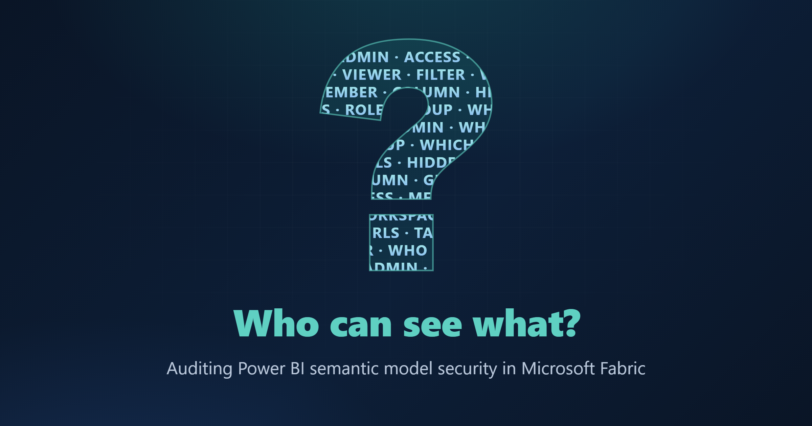

# Who Can See What? A Complete Power BI Access Audit Solution in Microsoft Fabric



*Fabric notebooks harvest RLS/OLS definitions, role memberships, AD group members, and workspace roles into a lakehouse — and a Power BI report on top answers every "who can see what?" question on demand.*

`Microsoft Fabric` · `Power BI` · `RLS / OLS` · `Security & Governance`

**Level:** Intermediate · **Read:** ~12 min · **Requires:** Microsoft Fabric + an Entra service principal · **Published:** Tuesday, September 1, 2026

| Authors | | |
|---|---|---|
| **Natarajan Manivasagan** · *Author* | [LinkedIn](https://www.linkedin.com/in/natarajan-manivasagan/) | [Fabric Community](https://community.fabric.microsoft.com/users/natarajan_m/1345926) |
| **Praful Potphode** · *Co-author* | [LinkedIn](https://www.linkedin.com/in/praful-p-912349241/) | [Fabric Community](https://community.fabric.microsoft.com/users/praful_potphode/1261729) |
| **Hardik Sri** · *Co-author* | [LinkedIn](https://www.linkedin.com/in/hardiksri98/) | [Fabric Community](https://community.fabric.microsoft.com/users/hardiksri/1586944) |

> 📦 **Everything is downloadable.** A **PBIP sample** (`contoso-access-audit-pbip.zip`) opens the finished six-page report on fabricated data with no tenant or credentials, and the whole pipeline is one runnable notebook, **[`NB_Semantic_Model_Access_Audit.ipynb`](NB_Semantic_Model_Access_Audit.ipynb)**, with a built-in validation section. All code and full details live in the [companion repo](https://github.com/NatarajanManivasagan/Fabric-Audit-Log).

---

## The problem

If you run a self-service BI platform, sooner or later someone from security, audit, or compliance asks a deceptively simple question — *"Can you show me exactly who can see what in Power BI?"* — which fans out into five:

1. **Which users** have access to each semantic model?
2. **Which security role** is each user tagged to?
3. **Which AD (Entra ID) group** grants that access?
4. **What workspace role** do they hold?
5. **What DAX filters (RLS)** — and table/column restrictions (OLS) — does each role apply?

For one model you can answer this by hand. Across a fleet of models in multiple workspaces — secured with a mix of **RLS**, **OLS**, and **Entra ID groups** — the manual answer is stale before you finish collecting it. So we built the audit *as a data product*: Fabric notebooks harvest security metadata from every model into a lakehouse, and a Power BI report answers all five questions on demand, with a refresh timestamp. Everything below is genericized (Contoso-ified) so you can map it to your own tenant.

---

## Solution architecture


Five parts: a **SharePoint `Model Inventory.xlsx`** controls scope (one row per model); an **Entra ID service principal** does all the reading (XMLA/TOM, REST, Graph); **Fabric notebooks** harvest the metadata; the **`pbi_security_audit` lakehouse** stores one Delta table per question domain; and a **semantic model + six-page report** form the consumption layer. The pipeline is one-way — Notebook 1 lands inventory, RLS/OLS, role memberships and AD-group expansion; Notebook 2 lands the workspace-role scan.

> 🧭 The steps below show the *essence* of each stage. The complete, runnable code is in the notebook — a self-contained, DataFrame-first variant; the snippets here show the **production** shape.

---

## Prerequisites

This is the part that takes longer than the code.

1. **App registration** in Entra ID: note Tenant ID / Client ID and create a client secret. Application permissions (admin-consented): Graph `Group.Read.All` and `Sites.Read.All`.
2. **Tenant settings** (Fabric admin portal): *Service principals can use Fabric APIs*; **XMLA endpoint** ≥ *Read*; and — for the app-audience extension — *Service principals can access read-only admin APIs*.
3. **Workspace access**: add the SP to every audited workspace (Contributor); missing ones are flagged instead of failing the run.
4. **Lakehouse**: create `pbi_security_audit` **with schema support** as the notebooks' default lakehouse.
5. **Library**: `%pip install semantic-link-labs`.

> ⚠️ **Secret hygiene.** The snippets read credentials from a `config.json` for simplicity. In production, use **Azure Key Vault** (`notebookutils.credentials.getSecret(...)`) — this is a *security audit*, so don't let it become the finding.

The lakehouse holds six tables — `pbi_model_details` (scope), `pbi_model_security_audit_details` (RLS + OLS, **Q5**), `pbi_model_security_role_association_details` (role → member, **Q2/Q3**), `pbi_model_security_adgroup_user_details` (group → people, **Q1/Q3**), `pbi_workspace_access_audit_details` (workspace roles, **Q4**), and a hand-curated `pbi_role_personas`. Full columns are in [`SCHEMA.md`](SCHEMA.md).

---

## Step 1 — Load the model inventory

Scope lives in one SharePoint workbook — one row per model. Authenticate as the service principal (MSAL client-credentials), pull the workbook through Microsoft Graph, and land it as `pbi_model_details` (`Workspace_Name`, `Semantic_Model_Name`). *(The self-contained notebook skips SharePoint — you list the `(workspace, model)` pairs inline in a `MODELS` variable.)* → [Step 1 in the notebook](NB_Semantic_Model_Access_Audit.ipynb).

---

## Step 2 — Extract RLS and OLS with semantic-link-labs (TOM)

The heart of the solution. For every model we open a **read-only TOM connection** under the service principal and walk `Roles` — reading each `TablePermission.FilterExpression` (the RLS DAX) and `MetadataPermission` (OLS). For OLS we walk every table/column and default to `Read`, so the output answers "what does this role *see*?" without the reader knowing OLS semantics:

```python
set_service_principal(config["TENANT_ID"], config["CLIENT_ID"], config["CLIENT_SECRET"])

with connect_semantic_model(dataset, workspace, readonly=True) as tom:
    for role in tom.model.Roles:
        for perm in role.TablePermissions:                 # RLS — the DAX filter
            if perm.FilterExpression:
                emit(role.Name, perm.Table.Name, filter=perm.FilterExpression, kind="RLS")
        for table in tom.model.Tables:                     # OLS — what's hidden
            for column in table.Columns:
                emit(role.Name, table.Name, column.Name,
                     visibility=effective_visibility(role, table, column), kind="OLS")
```

A model the SP *can't* read is written as a `Filter_Type = "ERROR"` row instead of failing the run — "we can't see this" is itself a finding. A whole table hidden collapses to one `Column_Name = "*"` row. → [Step 2 in the notebook](NB_Semantic_Model_Access_Audit.ipynb).

---

## Step 3 — Role memberships (and the query scale-out trap)

We also need **who is tagged to each role**. TOM exposes `role.Members`, and each `MemberID` is the **Entra object ID** — the join key for Step 4.

**The trap:** our first version used DAX `INFO.ROLES()` instead of TOM. Fine interactively — until a model with **query scale-out** enabled routed reads to replicas where security metadata isn't reliably served. **The fix:** detect `queryScaleOutSettings`; if scale-out is on, set `maxReadOnlyReplicas = 0`, let the replicas drain, extract via TOM on the primary, then **restore the setting**:

```python
for workspace, dataset in models:
    settings = get_scaleout_settings(ws_id, ds_id)          # Power BI REST
    if settings.get("maxReadOnlyReplicas", 0):              # scale-out on?
        update_scaleout(ws_id, ds_id, {"maxReadOnlyReplicas": 0})
        time.sleep(300)                                     # let read replicas drain
    with connect_semantic_model(workspace, dataset, readonly=True) as tom:
        for role in tom.model.Roles:
            for member in role.Members:
                emit(role.Name, member.MemberID)            # Entra object ID = join key
    update_scaleout(ws_id, ds_id, settings)                 # ALWAYS restore
```

Budget the drain wait per scale-out model, and make sure *restore* runs even on failure (`try/finally`). → [Step 3 in the notebook](NB_Semantic_Model_Access_Audit.ipynb).

---

## Step 4 — Expand AD groups into users via Microsoft Graph

Roles map to **Entra ID groups**, not individuals. A naming convention (`pbi-sec-*`) makes the lookup one filtered Graph query (`/groups?$filter=startswith(displayName,'pbi-sec')`); a second pass over each group's `/members` pulls the users. The linchpin: the role member's `MemberID` (TOM, Step 3) and the group's `id` (Graph) are **the same Entra object ID** — the join that connects *role → group → human being*. *(For nested groups, use `/transitiveMembers`.)* → [Step 4 in the notebook](NB_Semantic_Model_Access_Audit.ipynb).

---

## Step 5 — Workspace role assignments via the Fabric REST API

Model-level security means nothing if someone is workspace Admin. `GET /v1/workspaces/{id}/roleAssignments` returns every principal (user, group, or service principal) with a role; group principals are expanded to people via the Step 4 table, so the report always resolves to actual people. Both notebooks are idempotent, so a Fabric pipeline runs them off-hours and refreshes the model (the scale-out workaround adds ~5 min per affected model). → [Step 5 in the notebook](NB_Semantic_Model_Access_Audit.ipynb).


---

## Get the notebook — and check it's correct

All five steps are compiled into one **self-contained** notebook: **[`NB_Semantic_Model_Access_Audit.ipynb`](NB_Semantic_Model_Access_Audit.ipynb)** — no SharePoint, no config file. Fill in the **CONFIG** cell (`TENANT_ID` / `CLIENT_ID` / `CLIENT_SECRET` and a `MODELS` list), run the install cell, **restart the kernel** (auth needs `semantic-link` ≥ 0.12.0), then run top to bottom. It's **DataFrame-first** — nothing is written until you flip `persist` on, choosing **Delta tables** (production) or **CSV** export (what the sample report reads).

The notebook ends with a **validation section** that confirms all five result sets are non-empty, runs a **referential-integrity** check (`Member_ID = Group_Object_ID`), surfaces the `ERROR` rows, and answers all five questions in SQL for one model. Against the sample data all five tables built (5 / 65 / 10 / 31 / 16 rows) with **zero orphans** — then the check that earns its keep:

```
User_Name  | Role_Name     | Workspace                       | Workspace_Role
Jordan Lee | Finance - All | Contoso Finance Self-Service BI | Admin
```

Jordan Lee sits in an RLS role *and* holds workspace **Admin** — so that carefully-scoped role is doing nothing for them, because workspace Admins bypass RLS entirely. That single row is the whole reason this audit exists.

---

## The semantic model

The audit model is a small **import-mode** model over the lakehouse's SQL analytics endpoint. Every table follows the same Power Query pattern — connect, rename to friendly names, and (on the two role-grain tables) add a composite `Key = Workspace | Model | Role`, because a relationship on `Role Name` alone breaks the moment two models both define a "Viewer" role. The **linchpin relationship** joins Role AD Group Association to AD Group User Association on `Group Object ID` (TOM's `MemberID` = Graph's group `id` = the same Entra object ID — no name matching). A one-row **Last Updated Time** table stamps every page, and the **persona matrix** (`pbi_role_personas`) describes each role in plain business columns next to the raw DAX, so reviewers can catch "the filter says X but the persona sheet says Y" drift.


---

## The report

Six pages, one layout language (title, last-updated stamp, slicer rail), all shown on the **fabricated sample data**:

1. **Role – Persona Details** *(landing)* — Role → AD Group → User → UPN with slicers. **Q1/Q2/Q3**, showing *people*.
2. **Security Details (RLS)** — Role → Table → Filter (the DAX); a bookmark toggle flips to OLS.
3. **OLS** *(via toggle)* — Role → Table → Column → Permission, pre-filtered to what's hidden. With page 2: **Q5**.
4. **View Security Details** *(drill-through)* — the RLS filter matrix next to the persona description.
5. **AD Group Details** — Group → User → UPN. **Q3.**
6. **Workspace Access Details** — Workspace → principal → email → role. **Q4** — the page that finds the classic gap: a modest RLS role held by someone who is *also* workspace Admin.


---

## Extensions & download

Three further access paths ship in the notebook's *Optional extensions* cell: **app audiences** (`admin/apps`, needs the read-only-admin-API setting), **direct dataset permissions** (users in `datasets/{id}/users` but not `groups/{id}/users`), and **lineage** (report → model).

The sample — **`contoso-access-audit-pbip.zip`** — is the full six-page report and semantic model as a **PBIP project** with fabricated data (3 workspaces, 4 models, 10 roles, 12 AD groups, 30 users). Unzip to `C:\ContosoAccessAudit`, open the `.pbip`, and hit **Refresh** — no tenant or credentials. Its CSV headers match the names the notebooks write, so pointing it at your own lakehouse is a one-line swap (`Csv.Document(...)` → `Sql.Databases(...)`).


---

## Lessons learned

1. **Query scale-out silently breaks security extraction.** Read replicas don't reliably serve role/membership metadata — detect, drain, extract on the primary, restore.
2. **Record errors as data.** "SP not in workspace" becomes an `ERROR` row — a visible finding, not a silent hole.
3. **Translate DAX for your auditors.** The persona matrix turned the report from "a developer tool" into "the thing compliance signs off on".

What started as an awkward compliance question became a small data product: two notebooks, five Delta tables, one semantic model, six report pages — a scheduled refresh where every answer carries its own timestamp.

## Questions & suggestions

Questions, corrections, or a cleaner way around the scale-out drain? Leave a comment or reach out to the authors above — issues and pull requests on the [companion repo](https://github.com/NatarajanManivasagan/Fabric-Audit-Log) are welcome too.

**Further reading:** [semantic-link-labs](https://github.com/microsoft/semantic-link-labs) · [Row-level security (RLS)](https://learn.microsoft.com/fabric/security/service-admin-row-level-security) · [Object-level security (OLS)](https://learn.microsoft.com/fabric/security/service-admin-object-level-security) · [Roles in workspaces](https://learn.microsoft.com/fabric/fundamentals/roles-workspaces)

---

*The views in this post are my own and don't necessarily represent my employer. All workspace names, model names, group names, and IDs are fictionalized — the patterns are real.*
